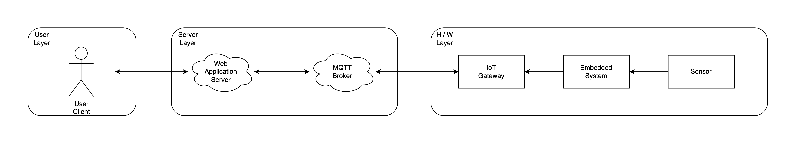

# IoT 시스템 디자인
이 책에서는 사용자가 웹을 통해 하드웨어와 통신할 수 있는 간단한 IoT 시스템을 구축해 봅니다. 예시 IoT 시스템에서는 아래 그림(iot_system_layer.png)과 같은 3개의 Layer를 나누어 설명합니다.

만약 온도 모니터링 시스템을 구축한다면 시스템의 큰 흐름은 다음과 같습니다.

1. H/W Layer에서 주기적으로 온도를 읽고 서버로 전송합니다.
2. 서버는 온도를 수신할 때마다 최신 데이터로 업데이트합니다. 
3. User Layer에서 사용자가 서버에게 온도 데이터를 요청합니다.
4. 서버는 가지고 있는 최신 온도 데이터를 사용자에게 전달합니다.

위의 큰 흐름을 기억해두고, 추후 세부적인 내용들을 확인해 봅니다. 

