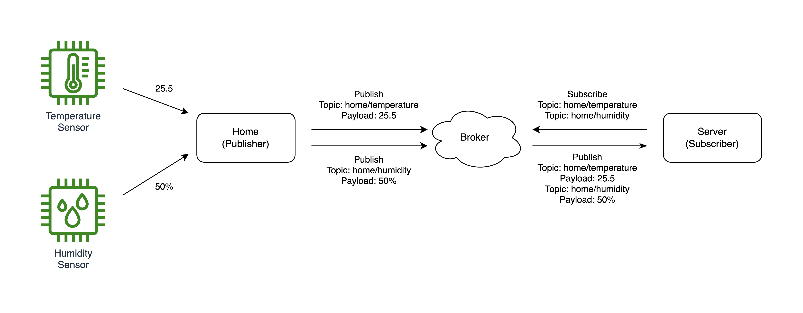

# MQTT 프로토콜
MQTT는 Message Queuing Telemetry Transport의 약자로 Publish / Subscribe (발행, 구독) 기반의 경량 메시징 프로토콜입니다. TCP / IP 위에서 동작하며, IoT와 같은 네트워크 대역폭이 제한되거나 대규모 트래픽을 위한 통신 프로토콜입니다.

## 개념

### MQTT Broker
MQTT 시스템에서의 서버 역할입니다. MQTT Client가 발행한 메시지를 구독자들에게 전송합니다.

### MQTT Client
MQTT Broker에 연결되어, 메시지를 Publish(발행), Subscribe(구독) 할 수 있는 단말입니다.

### Publisher
MQTT 토픽을 발행하는 MQTT Client입니다.
- MQTT 브로커에게 Topic을 발행합니다.
- 예시로 주기적으로 집의 온도를 발행하는 단말기라면 아래의 형식처럼 브로커에게 메시지를 전송합니다.
- topic: home/temperature
- payload: 25.5

### Subscriber
토픽을 구독하는 MQTT Client입니다.
- MQTT 브로커에게 Topic을 구독합니다.
- 예시로 브로커에게 home/temperature라는 토픽을 구독하면 집의 MQTT Client가 온도 데이터를 발행할 때마다 해당 데이터를 수신할 수 있습니다.

### Topic
메시지의 Pub / Sub (발행 / 구독)은 채널 단위로 일어납니다. 이를 Topic(토픽)이라고 하며 MQTT Client들은 특정 토픽을 발행하고 구독할 수 있습니다.
- 토픽은　디렉토리　구조처럼 여러 level 계층　구조를　가집니다. 예시로 다음과 같은 토픽이 있습니다.
    - home/kitchen/temperature
    - home/kitchen/humidity
    - home/restroom/temperature
    - home/restroom/humidity
- 또한 여러 토픽을 관리할 수 있게 wildcard를 지원합니다.
    - '+' 문자는 single level wildcard입니다. 1개의 토픽 레벨을 대체할 수 있습니다.
    - 예시로 위의 토픽들이 존재할때 집의 모든 방의 온도 데이터를 수신하고 싶다면, home/+/temperature를 구독합니다.
    - '#' 문자는 multi level wildcard입니다. 여러 레벨의 토픽을 대체할 수 있고 토픽의 제일 마지막에만 사용 가능합니다.
    - 예시로 집의 모든 데이터를 수신하고 싶다면, home/# 을 구독합니다.

### QoS (Quality of service)
브로커에 대한 각 연결은 QoS 값을 설정할 수 있습니다.
- QoS 0 
  - 최대 1회 전송합니다.
  - 메시지를 전송하면 브로커와 클라이언트는 메시지가 잘 전달되었는지 확인하는 추가 단계를 거치지 않습니다. 
  - 메시지를 보낸 다음 잊어버립니다.
- QoS 1
    - 최소 1회 전송합니다.
    - 메시지의 확인 응답을 수신할 때까지 여러 번 재전송합니다.
    - 확인 응답을 거치는 전달입니다.
    - 엄밀한 핸드셰이킹 과정을 거치지 않아, 중복된 메시지를 수신할 수 있습니다.
- QoS 2
  - 메시지의 수신을 정확히 1회 보장합니다.
  - 메시지의 핸드셰이킹 과정을 추적하여, 정확히 한 번 수신할 수 있도록 보장합니다.
  - 성능 희생이 따릅니다.
  - 보장된 전달입니다.

### LWT (Last will and testament)
MQTT Client는 비정상적으로 연결이 종료되었을 때를 대비하여 유언을 남길 수 있습니다. 예시로 주방 클라이언트가 브로커와 연결할 때 아래와 같은 유언을 등록했다고 가정해 봅니다.
- Will topic: home/kitchen/will
- Will message: "kitchen network is dead!"
- 주방 클라이언트의 네트워크가 불안정하여 연결이 끊어지면 브로커는 미리 등록된 유언을 구독자들에게 발행합니다.
- 해당 Will topic을 구독해놓은 구독자들은 Will message로 주방 네트워크가 죽었다는 메시지를 받게 됩니다. 
    
