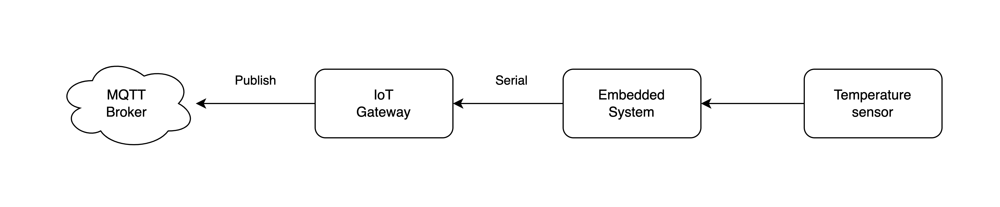

# H/W Layer Design

[//]: # (
그림 수정 예정 
1. Temperature sensor -> sensor
2. Publish -> MQTT Publish
)

H/W 계층은 아래 그림과 같이 센서의 데이터를 수집하는 임베디드 시스템과 수집한 데이터를 서버 계층에 전달하는 게이트웨이로 구성됩니다.

  

### H/W 계층 구성 요소

#### Gateway

임베디드 보드에게 전달받은 데이터를 MQTT 브로커에게 발행합니다.

    - Tech keyword: C, Arduino, ESP 8266

- Embedded System
    - 센서의 데이터를 읽는 임베디드 보드
    - 임베디드 보드에서 네트워크 작업이 가능하면, IoT Gateway의 기능을 임베디드 보드에 넣어도 괜찮습니다.
    - Tech keyword: xxx
- Sensor
    - 임베디드 시스템이 데이터를 가져올 센서
    - 예제 IoT 시스템에서는 xxx 센서를 사용합니다.
    - Tech keyword: xxx

  

[//]: # (#### 이 예제에서는 관심사를 나누어 임베디드 보드와 Gateway가 통신하는 방법을 기술합니다.)

