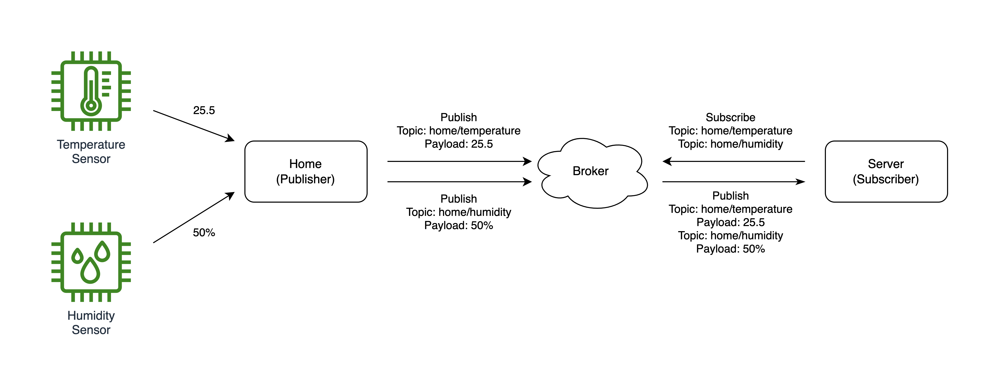

# MQTT 프로토콜

---

MQTT는 Message Queuing Telemetry Transport의 약자로 Publish / Subscribe (발행, 구독) 기반의 경량 메시징 프로토콜입니다.
TCP / IP 위에서 동작하며, IoT와 같은 네트워크 대역폭이 제한되거나 대규모 트래픽을 위한 통신 프로토콜입니다.

## IoT 시스템 구성 요소

