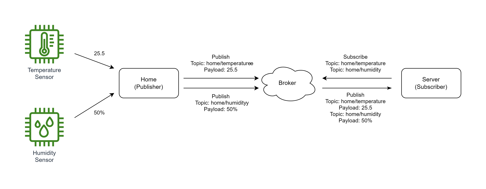

# MQTT 프로토콜

MQTT는 Message Queuing Telemetry Transport의 약자로
Publish / Subscribe (발행, 구독) 기반의 경량 메시징 프로토콜이다.
TCP / IP 위에서 동작하며, IoT와 같은 네트워크 대역폭이 제한되거나
대규모 트래픽을 위한 통신 프로토콜이다.

## 개념

- MQTT Broker
    - MQTT 시스템에서의 서버 역할
    - MQTT Client가 발행한 메시지를 구독자들에게 전송한다

- MQTT Client
    - MQTT Broker에 연결되어, 메시지를 Publish, Subscribe 할 수 있는 단말

- Publisher
    - 토픽을 발행하는 MQTT Client
    - MQTT 브로커에게 Topic을 발행한다
    - 예시로 주기적으로 집의 온도를 발행하는 단말기라면 아래의 형식처럼 브로커에게 메시지를 전송한다
        - topic: home/temperature
        - payload: 25.5

- Subscriber
    - 토픽을 구독하는 MQTT Client
    - MQTT 브로커에게 Topic을 구독한다
    - 예시로 브로커에게 home/temperature 라는 토픽을 구독하면, 집의 단말기가 온도 데이터를 발행할 때마다 수신할 수 있다

- Topic
    - 메시지의 Pub / Sub (발행 / 구독)은 채널 단위로 일어난다
    - 이를 Topic(토픽)이라고 하며, MQTT Client들은 특정 토픽을 발행하고, 구독할 수 있다
    - 토픽은　디렉토리　구조처럼 여러 level 계층　구조를　가진다. 예시로 다음과 같은 토픽이 있다
        - home/kitchen/temperature
        - home/kitchen/humidity
        - home/restroom/temperature
        - home/restroom/humidity
    - 또한 여러 토픽을 관리할수있게 wildcard를 지원한다
        - '+' 문자는 single level wildcard이며 1개의 토픽 레벨을 대체할 수 있다
        - 예시로 집의 모든 방의 온도 데이터를 수신하고 싶다면, home/+/temperature 를 구독한다
        - '#' 문자는 multi level Wildcard 여러 레벨의 토픽을 대체할 수 있으며 토픽의 제일 마지막에만 사용 가능하다.
        - 예시로 집의 모든 데이터를 수신하고 싶다면, home/# 을 구독한다

- QoS (Quality of service)
    - 브로커에 대한 각 연결은 QoS 값을 설정할 수 있다
    - QoS 0
        - 최대 1회 전송
        - 메시지를 전송하면 브로커와 클라이언트는 메시지가 잘 전달되었는지 확인하는 추가 단계를 거치지 않는다
        - 메시지를 보낸 다음 잊어버린다
    - QoS 1
        - 최소 1회 전송
        - 메시지의 확인 응답을 수신할 때까지 여러번 재전송
        - 엄밀한 핸드셰이킹 과정을 거치지 않아, 중복된 메시지를 수신할 수 있다
        - 확인 응답을 거치는 전달
    - QoS 2
    - 정확히 1회 보장
    - 메시지의 핸드셰이킹 과정을 추적하여, 정확히 한 번 수신할 수 있도록 보장한다
    - 성능 희생이 따른다
    - 보장된 전달

- LWT (Last will and testament)
    - 클라이언트는 비 정상적으로 연결이 종료되었을때를 대비하여, 유언을 남길 수 있다
    - 예시로 주방 클라이언트가 브로커와 연결할때 아래와 같은 유언을 등록한다
        - Will topic: home/kitchen/will
        - Will message: "kitchen network is dead!"
    - 주방 클라이언트의 네트워크가 불안정하여 연결이 끊어지면 브로커는 미리 등록된 유언을 구독자들에게 발행한다
    - 해당 Will topic을 구독해놓은 구독자들은 Will message로 주방 네트워크가 죽었다는 메시지를 받게된다 
    
