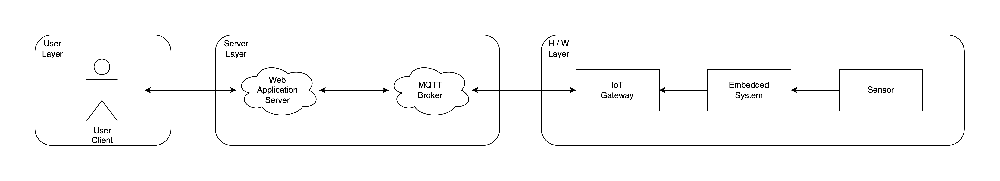

## 시스템 구성도

예시 IoT 시스템에서는 그림과 같은 3개의 Layer를 나누어 개발한다

### H/W Layer

#### 이 예제에서는 관심사를 나누어 임베디드 보드와 Gateway가 통신하는 방법을 기술한다

- IoT Gateway
  - 임베디드 보드에게 전달받은 데이터를 MQTT 브로커에게 발행할 IoT Gateway
  - Tech keyword: C, Arduino, ESP 8266 
- Embedded System
  - 센서의 데이터를 읽는 임베디드 보드
  - 임베디드 보드에서 네트워크 작업이 가능하면, IoT Gateway의 기능을 임베디드 보드에 넣어도 괜찮다
  - Tech keyword: xxx
- Sensor
  - 임베디드 시스템이 데이터를 가져올 센서
  - 예제 IoT 시스템에서는 xxx 센서를 사용한다
  - Tech keyword: xxx

  
  
### Server Layer

#### 

- MQTT Broker
  - 서버와 IoT Gateway의 통신을 중개
  - 오픈소스 MQTT 브로커인 Mosquitto를 사용한다 (https://mosquitto.org/)
  - Tech keyword: MQTT, Mosquitto

- Web Application Server
  - MQTT 브로커에게 전달받은 온도 데이터를 사용하는 backend
  - 브로커에게 온도 topic을 구독
  - 브로커가 보낸 온도 데이터를 저장한다
  - 사용자가 온도를 요청하면 저장한 온도 데이터를 전달한다
  - Tech keyword: TypeScript, NestJS

- User Client
  - 서버에게 온도 데이터를 요청하는 frontend
  - Tech keyword: HTML, JavaScript <-- React 고민중
  
