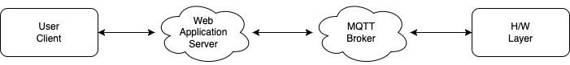

# IoT 시스템 디자인

- 이 책에서는 하드웨어와 통신할 수 있는 간단한 IoT 시스템을 구축해본다.
- 시스템의 큰 그림은 다음과 같다.
  

- 예시로 온도 모니터링 시스템을 구축한다면, 시스템의 큰 흐름은 다음과 같을 것이다.

1. 하드웨어에서 주기적으로 온도를 읽음
2. 온도 데이터를 읽을 때마다 서버로 전송
3. 서버는 온도 데이터를 수신할 때마다, 최신 데이터로 업데이트
4. 사용자가 서버에게 온도 데이터를 요청
5. 서버는 가지고있는 최신 온도 데이터를 사용자에게 전달

위의 큰 흐름을 기억해두고, 추후 세부적인 내용들을 확인해본다. 

