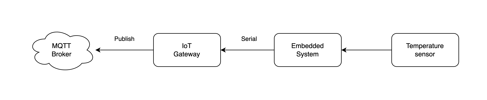

# H/W Layer Design

[//]: # (
그림 수정 예정 
1. Temperature sensor -> sensor
2. Publish -> MQTT Publish
)

H/W 계층은 아래 그림과 같이 센서의 데이터를 수집하는 임베디드 시스템과 수집한 데이터를 서버 계층에 전달하는 게이트웨이로 구성됩니다.
예시로 매장의 온도 모니터링 시스템을 개발한다고 생각해봅시다.

